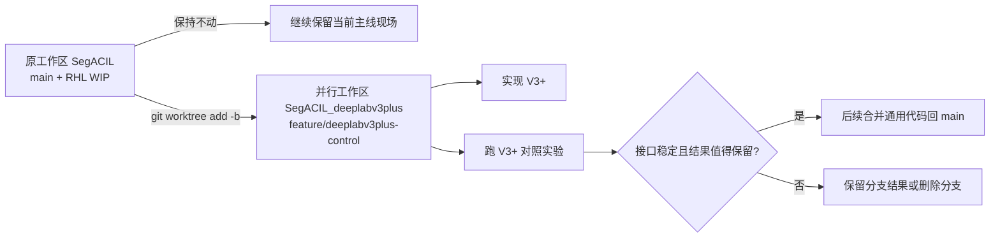

# DeepLabV3+ 对照实验：分支策略、代码接入方式与执行工作流

日期：2026-06-12  
项目：`/root/2TStorage/lyc/SegACIL`  
目标：为 CFSSeg / SegACIL 增加一个 DeepLabV3+ + ResNet101 的对照实验版本，判断应直接写入 `main`，还是先开独立分支实验，并给出后续可直接交给 Codex 执行的工作流。

---

## 0. 最终结论

**不要在当前 `main` 工作区直接继续写 DeepLabV3+ 代码。**

最终方案是：

```text
使用独立 feature branch，优先用 git worktree 创建一个干净的并行工作区。
在该分支中把 DeepLabV3+ 做成代码库的一等模型选项，而不是临时实验 hack。
run.sh 保持 DeepLabV3 为默认模型，但允许通过环境变量选择 deeplabv3plus_resnet101。
跑完 smoke test 和至少一条 VOC 15-5 sequential 完整实验后，再决定是否把通用模型代码合并回 main。
实验 checkpoint / log / 大结果文件不合并进 main。
```

推荐分支名：

```bash
feature/deeplabv3plus-control
```

推荐并行工作区：

```bash
/root/2TStorage/lyc/SegACIL_deeplabv3plus
```

这个方案不是简单地“开分支做完就丢掉”，也不是“直接污染 main”。它是一个两阶段方案：

1. **实验隔离阶段**：在 feature branch / worktree 中实现、验证、跑结果。
2. **代码吸收阶段**：如果接口稳定、结果可解释，就把通用 DeepLabV3+ 支持合并回 `main`，但不改变默认 baseline。

---

## 1. 为什么不直接在当前 main 写

当前仓库处于 `main` 分支，但工作区不是干净状态。已观察到：

```text
D  Codex_Plans/PLAN.md
M  network/Buffer.py
M  run.sh
M  trainer/trainer.py
M  utils/parser.py
?? AI_docs/... 若干未跟踪文档
?? run_rhl_norm.sh
```

这些改动主要与 RHL 归一化、运行脚本和文档有关。DeepLabV3+ 是一个架构对照实验，和 RHL 归一化属于不同变量。直接在这个状态下继续改 `main` 有三个问题：

| 风险 | 具体后果 |
|---|---|
| 实验变量混杂 | DeepLabV3+ 的涨跌点可能和 RHL 改动、脚本改动、默认 step 设置混在一起 |
| 回滚困难 | 如果 V3+ 接口不稳定，恢复到可复现实验状态会麻烦 |
| 合并判断困难 | 后续很难区分哪些代码应进入主线，哪些只是对照实验临时改动 |

更重要的是，当前 DeepLabV3+ 不是“改一行 `MODEL` 就能跑”的状态。它需要改模型工厂、head 返回接口、AIR feature 接口和 run workflow。这样的改动应先隔离验证。

---

## 2. 三种方案比较

### 2.1 方案 A：直接在 main 写 DeepLabV3+，并把它加入 run.sh

| 维度 | 评价 |
|---|---|
| 优点 | 路径短；后续使用方便；如果写得好，代码自然成为长期能力 |
| 缺点 | 当前 `main` 已有未提交 WIP；架构变量会混入主线；失败后污染主分支 |
| 适用条件 | 工作区干净、任务已确定要作为正式代码维护、实现风险低 |
| 当前是否推荐 | 不推荐 |

直接写 `main` 最大的问题不是“模型选项不该进主线”，而是 **现在还没验证接口是否稳、结果是否有价值，并且当前 main 不干净**。

### 2.2 方案 B：开一个实验分支，做完只在分支里跑结果

| 维度 | 评价 |
|---|---|
| 优点 | 隔离干净；失败成本低；不影响当前 DeepLabV3/RHL 主线 |
| 缺点 | 如果只做实验 hack，后续难以复用；分支长期游离会造成代码分叉 |
| 适用条件 | 不确定是否值得长期维护、需要快速验证 |
| 当前是否推荐 | 推荐，但要加一个约束：代码必须按可合并标准写 |

单纯“实验分支跑完就走”不够好。DeepLabV3+ 是合理的长期对照底座，应该在分支中按正式代码质量接入。

### 2.3 方案 C：feature branch + 自然接入 + 验证后再合并

| 维度 | 评价 |
|---|---|
| 优点 | 隔离风险；代码质量按主线标准写；结果好坏都可解释；后续可合并 |
| 缺点 | 比直接改 main 多一步分支/工作区管理 |
| 适用条件 | 架构对照、工程改动中等、结果不确定但可能长期有用 |
| 当前是否推荐 | 最终方案 |

方案 C 的核心是：

```text
实验先隔离，代码按主线标准写，默认行为不改变，验证后再决定合并。
```

---

## 3. 为什么优先使用 git worktree

普通 `git switch -c feature/deeplabv3plus-control` 要求当前工作区能安全切分支。当前 `main` 有多个未提交改动，切分支容易把 RHL WIP 一起带到 DeepLabV3+ 分支。

更稳的方式是使用 `git worktree`：



优点：

1. 不需要 stash 当前 RHL 改动。
2. 不需要立即 commit 当前未完成工作。
3. DeepLabV3+ 从干净代码状态开始，变量更清楚。
4. 实验 checkpoint、log 和中间文件自然落在并行工作区，避免污染当前主线目录。

注意：如果后续希望把 V3+ 建立在已经完成的 RHL 代码之上，应先把 RHL 工作整理成独立 commit 或独立分支，再从那个 commit 创建 V3+ 分支。当前对照实验的推荐是 **先做架构 baseline，不叠加 RHL 新变量**。

---

## 4. 当前代码的 DeepLabV3+ 阻塞点

### 4.1 model name 存在，但 ResNet V3+ 未接通

`network/modeling.py` 中 `model_map` 已经列出：

```python
'deeplabv3plus_resnet50': self.deeplabv3plus_resnet50,
'deeplabv3plus_resnet101': self.deeplabv3plus_resnet101,
```

但 ResNet 分支 `_segm_resnet()` 当前只支持：

```python
if name == 'deeplabv3':
    classifier = DeepLabHead(...)
elif name == "deeplabv3_bga":
    classifier = DeepLabHeadBgA(...)
else:
    raise ValueError(...)
```

所以直接运行：

```bash
MODEL=deeplabv3plus_resnet101 bash run.sh
```

会在构建 ResNet V3+ 时失败。

### 4.2 DeepLabHeadV3Plus 返回接口不符合训练代码

当前 `DeepLabHead.forward()` 返回：

```python
return heads, {
    "feature": feature,
    "back_out": back_out,
}
```

而当前 `DeepLabHeadV3Plus.forward()` 只返回：

```python
return heads
```

训练代码和 `_SimpleSegmentationModel.forward()` 期望 classifier 返回 `(x, feat)`。因此 V3+ head 必须补齐 `feat_dict`。

### 4.3 AIR step1 依赖“去掉最终分类层后输出 256-d dense feature”

当前 step1 realignment 逻辑在 `trainer/trainer.py` 中直接做：

```python
self.model.classifier.head = nn.Identity()
backbone = self.model
self.model = AIR(backbone_output=256, backbone=backbone, ...)
```

这对当前 `DeepLabHead` 成立：`head_pre` 输出 256-d feature，`head` 被换成 `Identity()` 后，模型的第一个输出变为 `B x 256 x H x W`，刚好能送入 RHL。

DeepLabV3+ 必须保持同样契约：

```text
正常 step0:
    model(images) -> logits, feat_dict

step1 替换最终分类层后:
    model(images) -> 256-d dense feature map, feat_dict
```

因此 V3+ 不能沿用当前 `ModuleList([Conv2d(... c ...)])` 的 head 结构。更适合改成：

```text
project low-level feature
ASPP high-level feature
upsample + concat
decoder: 304 -> 256
head: per-pixel Linear(256, sum(num_classes))
```

这样 `classifier.head = nn.Identity()` 后仍然暴露 256-d feature，和当前 AIR 逻辑兼容。

### 4.4 V3+ 的空间分辨率会提高，训练成本可能上升

DeepLabV3+ 使用 low-level feature，decoder 输出通常在更高空间分辨率上。对普通分割训练这是优势，但对 AIR / C-RLS 会带来更多 pixel samples：

```text
DeepLabV3 feature:   B x 256 x H/8 x W/8
DeepLabV3+ feature:  B x 256 x H/4 x W/4  或相近尺度
```

这会增加：

1. RHL 前向计算量；
2. `X.T @ X` 的累积成本；
3. 中间特征显存；
4. step1 realignment 的耗时。

所以 V3+ 对照实验必须把 batch size、feature resolution、运行时间记录清楚。若显存不足，可先降低 batch size，但报告中必须标注。

---

## 5. 最终工程策略

### 5.1 分支策略

采用：

```text
feature/deeplabv3plus-control
```

推荐用 worktree 创建：

```bash
cd /root/2TStorage/lyc/SegACIL
git worktree add -b feature/deeplabv3plus-control ../SegACIL_deeplabv3plus HEAD
cd /root/2TStorage/lyc/SegACIL_deeplabv3plus
```

如果 `git worktree add` 因分支已存在失败，则使用：

```bash
git worktree add ../SegACIL_deeplabv3plus feature/deeplabv3plus-control
```

如果不允许创建并行目录，才考虑普通分支方案；普通分支方案要求先处理当前 dirty worktree，不建议直接携带 WIP 切分支。

### 5.2 代码接入策略

DeepLabV3+ 应作为一等模型选项接入：

```text
deeplabv3_resnet101       # 默认 baseline
deeplabv3plus_resnet101   # 新增对照模型
```

但 `run.sh` 默认值不改成 V3+：

```bash
MODEL="${MODEL:-deeplabv3_resnet101}"
```

使用 V3+ 时显式指定：

```bash
MODEL=deeplabv3plus_resnet101 SUBPATH=20260612_v3plus_voc15-5 START_STEP=0 END_STEP=1 bash run.sh
```

这样既“自然融入代码库”，又不会改变现有 baseline 行为。

### 5.3 实验策略

V3+ 是架构对照，不应和 RHL normalization 同时作为变量变更。第一轮只做：

| 实验 | Model | RHL norm | 目的 |
|---|---|---|---|
| A | DeepLabV3 + ResNet101 | none | 原 CFSSeg baseline |
| B | DeepLabV3+ + ResNet101 | none | 纯 decoder / architecture 对照 |

如果 B 跑通且结果稳定，再做：

| 实验 | Model | RHL norm | 目的 |
|---|---|---|---|
| C | DeepLabV3 + ResNet101 | best RHL norm | 主线方法 |
| D | DeepLabV3+ + ResNet101 | best RHL norm | architecture robustness |

论文写法：

```text
Main experiments keep the original DeepLabV3-ResNet101 setting for fair comparison.
DeepLabV3+ is evaluated as a stronger decoder control to test architecture robustness.
```

---

## 6. 详细执行工作流

### Step 0：记录当前主工作区状态

只记录，不修改：

```bash
cd /root/2TStorage/lyc/SegACIL
git branch --show-current
git status --short
```

预期当前在 `main`，且有 RHL WIP。不要在这个状态直接写 V3+。

### Step 1：创建并进入 V3+ worktree

```bash
cd /root/2TStorage/lyc/SegACIL
git worktree add -b feature/deeplabv3plus-control ../SegACIL_deeplabv3plus HEAD
cd /root/2TStorage/lyc/SegACIL_deeplabv3plus
git status --short
git branch --show-current
```

要求：

```text
branch = feature/deeplabv3plus-control
status = clean
```

如果工作区不干净，停止并先查明来源。

### Step 2：实现 ResNet101 DeepLabV3+ 模型路径

修改 `network/modeling.py`：

1. `_segm_resnet()` 中当 `name == "deeplabv3plus"` 时：
   - `return_layers = {"layer4": "out", "layer1": "low_level"}`;
   - `classifier = DeepLabHeadV3Plus(2048, 256, num_classes, aspp_dilate)`。
2. 保留 `deeplabv3_resnet101` 原逻辑不变。
3. 保留 `deeplabv3plus_mobilenet` 已有路径，但确保 V3+ head 改动不破坏它。

### Step 3：重写 DeepLabHeadV3Plus 的输出契约

修改 `network/_deeplab.py` 中 `DeepLabHeadV3Plus`：

1. 拆成 `project`、`aspp`、`decoder`、`head`。
2. `decoder` 输出 256-d dense feature。
3. `head` 使用 `nn.Linear(256, sum(num_classes))`，保持和当前 `DeepLabHead` 类似的替换契约。
4. `forward()` 正常返回：

```python
return heads, {
    "feature": feature,
    "decoder_feature": decoder_feature,
    "back_out": feature_dict["out"],
    "low_level": low_level_feature,
}
```

其中关键是：

```text
classifier.head = nn.Identity()
```

后，`model(images)` 的第一个返回值必须是 `B x 256 x H' x W'`，能被 `AIR.feature_expansion()` 直接接收。

### Step 4：让 run.sh 只增加可选性，不改变默认实验

把硬编码：

```bash
MODEL="deeplabv3_resnet101"
START_STEP=1
END_STEP=1
```

改成：

```bash
MODEL="${MODEL:-deeplabv3_resnet101}"
START_STEP="${START_STEP:-1}"
END_STEP="${END_STEP:-1}"
```

如果当前分支没有 RHL 参数，先不要引入 RHL 新参数；如果当前分支从已有 RHL 代码继续，则默认仍必须是：

```bash
RHL_NORM="${RHL_NORM:-none}"
```

V3+ 全流程必须从 step0 开始，因为 DeepLabV3 的 step0 checkpoint 不能复用。

### Step 5：做无数据 smoke test

先验证模型构建和前向接口：

```bash
cd /root/2TStorage/lyc/SegACIL_deeplabv3plus
python - <<'PY'
import torch
from network.modeling import DeepLabModelFactory

factory = DeepLabModelFactory()
model = factory.model_map["deeplabv3plus_resnet101"](
    num_classes=[1, 15],
    output_stride=8,
    pretrained_backbone=False,
    bn_freeze=False,
)
model.eval()
x = torch.randn(2, 3, 512, 512)
with torch.no_grad():
    y, feat = model(x)
print("normal logits:", tuple(y.shape))
print("feat keys:", sorted(feat.keys()))

model.classifier.head = torch.nn.Identity()
with torch.no_grad():
    z, feat2 = model(x)
print("air feature:", tuple(z.shape))
assert z.shape[1] == 256, z.shape
assert torch.isfinite(z).all()
PY
```

通过标准：

```text
normal logits channel = sum(num_classes)
air feature channel = 256
no exception
no NaN / Inf
```

### Step 6：做最小训练入口 smoke test

先不跑 50 epoch，验证 train.py 能创建模型、创建 dataloader、进入训练。建议使用极短 epoch 或至少先跑到前几次 iteration 后人工停止。

如果要写自动 smoke script，应避免把大 checkpoint 加入 git。

### Step 7：跑 VOC 15-5 sequential 完整对照实验

V3+ 不能复用 DeepLabV3 step0，因此从 step0 到 step1 全跑：

```bash
cd /root/2TStorage/lyc/SegACIL_deeplabv3plus
MODEL=deeplabv3plus_resnet101 \
TASK=15-5 \
SETTING=sequential \
SUBPATH=20260612_v3plus_voc15-5_seq \
START_STEP=0 \
END_STEP=1 \
GAMMA=1 \
bash run.sh
```

如果显存不足，先记录错误，再调整：

```bash
DEFAULT_BATCH_SIZE=16
SPECIAL_BATCH_SIZE=16
```

或者把 `run.sh` 改成：

```bash
DEFAULT_BATCH_SIZE="${DEFAULT_BATCH_SIZE:-32}"
SPECIAL_BATCH_SIZE="${SPECIAL_BATCH_SIZE:-32}"
```

再通过环境变量控制。调整 batch size 后，报告中必须注明。

### Step 8：汇总结果

完成后提取：

```bash
find checkpoints/20260612_v3plus_voc15-5_seq -name 'test_results_*.json' -print
```

记录：

| 指标 | 位置 |
|---|---|
| old 0-15 mIoU | `0 to 15 mIoU` |
| new 16-20 mIoU | `16 to 20 mIoU` |
| all mIoU | `Mean IoU` |
| 每类 IoU | `Class IoU` |
| batch size / epoch / model | run log 和 run.sh |

写报告到：

```text
AI_docs/代码改动报告/DeepLabV3Plus对照实验代码改动与结果报告.md
```

如果是在 worktree 中写报告，后续再决定是否同步到主仓库。

### Step 9：合并决策

满足以下条件才考虑合并回 `main`：

1. `deeplabv3_resnet101` smoke test 仍通过。
2. `deeplabv3plus_resnet101` smoke test 通过。
3. `run.sh` 默认仍是 DeepLabV3，不改变现有 baseline。
4. V3+ 至少完成 15-5 sequential step0+step1。
5. checkpoint、log、大文件没有进入 git。
6. 代码没有引入 RHL normalization 以外的新混杂变量。

合并时只合并：

```text
network/modeling.py
network/_deeplab.py
run.sh 的环境变量化选择
必要文档
```

不合并：

```text
checkpoints/
logs/
events.out.tfevents*
*.pth
临时 shell 输出
```

---

## 7. 合并后的主线形态

合并成功后的理想状态是：

```text
main
├── 默认仍可复现原 CFSSeg DeepLabV3 + ResNet101
├── MODEL=deeplabv3plus_resnet101 时可切换到 DeepLabV3+ + ResNet101
├── V3+ 不改变 checkpoint 兼容假设：旧 DeepLabV3 checkpoint 不强行复用
└── 文档明确标注 V3+ 是架构对照，不是主贡献
```

用户或 Codex 后续可以这样跑：

```bash
# 原 baseline
MODEL=deeplabv3_resnet101 SUBPATH=20260612_v3_voc15-5_seq START_STEP=0 END_STEP=1 bash run.sh

# V3+ 对照
MODEL=deeplabv3plus_resnet101 SUBPATH=20260612_v3plus_voc15-5_seq START_STEP=0 END_STEP=1 bash run.sh
```

---

## 8. 论文与实验解释边界

DeepLabV3+ 对照实验的正确定位：

```text
strong decoder control / architecture robustness
```

不要写成：

```text
我们的核心方法通过把 DeepLabV3 换成 DeepLabV3+ 提升了性能
```

应该写成：

```text
为了排除结果只依赖特定 DeepLabV3 decoder 的可能性，我们额外在 DeepLabV3+ + ResNet101 上验证方法兼容性。
主表仍使用 CFSSeg 原始 DeepLabV3 + ResNet101 设置，以保持公平比较。
```

如果 V3+ new mIoU 上升，可以解释为：

1. 低层特征和 decoder 细节改善了冻结特征的线性可分性；
2. 新类边界和小目标区域更容易被解析头利用；
3. 但增益中包含架构贡献，不能单独归因给 RHL / C-RLS 方法。

如果 V3+ 没涨或下降，也不说明 CFSSeg 机制失败，可能原因包括：

1. V3+ 高分辨率 feature 让 RLS 数值条件变差；
2. batch size 变化影响 step0 训练；
3. 低层纹理特征增加噪声；
4. 当前 `gamma` / `buffer` 对 V3+ feature 分布不再最优。

---

## 9. 一句话执行指令

后续交给 Codex 执行时，可以直接使用这条任务描述：

```text
在 /root/2TStorage/lyc/SegACIL 中不要直接污染当前 main。用 git worktree 创建 feature/deeplabv3plus-control 分支到 /root/2TStorage/lyc/SegACIL_deeplabv3plus，在该分支中把 deeplabv3plus_resnet101 接成一等模型选项；保持 run.sh 默认 MODEL=deeplabv3_resnet101，但允许 MODEL=deeplabv3plus_resnet101 START_STEP=0 END_STEP=1 bash run.sh 完整跑 15-5 sequential。先做模型前向 smoke test，再跑完整实验。实验结束后写结果报告，只有 smoke test 和完整结果通过后，再考虑把通用代码合并回 main。
```
