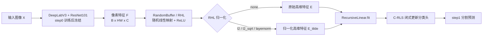

# RHL 归一化专题报告：原理、实现、实验结果与结论

> 项目：`/root/2TStorage/lyc/SegACIL`  
> 日期：2026-06-11  
> 主题：方案一“RHL 归一化”的代码机制与实验验证  
> 结论版本：基于 VOC `15-5` sequential `step1`、`BASE_SUBPATH=20260606` 的当前实验结果

## 0. 一句话结论

当前 RHL 归一化代码实现是有效接入的，实验也已经完整跑完；但是在 batch size 对齐的主对照中，`l2_sqrt` 没有提升指标，反而低于 `none` baseline。因此，**RHL 归一化暂不适合作为论文主贡献模块**，更适合作为数值稳定性/消融分析模块保留。

更具体地说：

1. `l2_sqrt` 确实把每个像素的 RHL 特征范数固定到 `sqrt(8196) = 90.5318` 左右，说明代码机制生效。
2. 第二组 `gamma=0.1/1/10` 三个实验全部完成，且结果几乎完全一致，说明当前尺度下 `gamma` 扫描没有实际收益。
3. 与 `none_bs64` 相比，`l2_sqrt_bs64` 的 all mIoU 低约 `0.157` 个百分点，新类 mIoU 低约 `0.451` 个百分点。
4. 第一组中 `l2_sqrt_bs32` 看起来更好，但它的 batch size 与主要 `bs64` 对照不同，不能直接归因于 RHL 归一化。

---

## 1. 实验完成性检查

第二组实验原本在 tmux 会话 `rhl_gamma_sweep` 中排队执行：

```text
l2_sqrt gamma=0.1 -> l2_sqrt gamma=1 -> l2_sqrt gamma=10
```

当前检查结果：

| 检查项 | 结果 |
|---|---|
| `rhl_gamma_sweep` tmux 会话 | 已不存在，说明队列已结束 |
| 三个 subpath 是否生成 | 是 |
| 三个 step1 `final.pth` 是否存在 | 是 |
| 三个 step1 `test_results_*.json` 是否存在 | 是 |
| 日志是否显示参数传入 | 是，`Config(...)` 中有对应 `gamma` 与 `rhl_norm='l2_sqrt'` |
| 日志是否有 NaN/Inf | `RHL stats` 显示 `nan=False inf=False` |
| 日志是否有 Traceback/OOM | 第二组三个正式日志未发现错误 |

第二组结果文件：

```text
checkpoints/20260610_rhl_l2sqrt_g0p1_bs64/voc/15-5/sequential/step1/test_results_20260610_204628.json
checkpoints/20260610_rhl_l2sqrt_g1_bs64/voc/15-5/sequential/step1/test_results_20260610_221231.json
checkpoints/20260610_rhl_l2sqrt_g10_bs64/voc/15-5/sequential/step1/test_results_20260610_233856.json
```

---

## 2. RHL 在 CFSSeg / SegACIL 中的位置

CFSSeg 的解析持续学习流程可以理解为两段：

1. **step0：普通深度分割训练**
   - 用 DeepLabV3 + ResNet101 训练基础类。
   - 这一步会更新 backbone 和分割头。

2. **step1 及之后：冻结特征 + 解析分类头**
   - 冻结 step0 训练好的特征提取部分。
   - 对每个像素提取特征。
   - 经过 RHL 随机高维映射。
   - 用 C-RLS / ridge regression 闭式更新分类头。

流程图如下：



RHL 的作用不是像 CNN 那样训练出一个新特征层，而是用一个固定随机矩阵把特征升到高维空间，让后面的线性解析分类头更容易拟合类别边界。

---

## 3. 数学原理：从 RHL 到闭式解

### 3.1 原始 RHL 映射

对某个像素的 backbone 特征记作：

$$
f_i \in \mathbb{R}^{C}
$$

RHL 用固定随机矩阵做高维映射：

$$
e_i = \operatorname{ReLU}(f_i W_r)
$$

其中：

- $f_i$：第 $i$ 个像素的 CNN 特征；
- $W_r$：随机初始化、后续固定不训练的 RHL 权重；
- $e_i$：高维随机特征，维度为 `buffer=8196`。

把所有像素堆起来：

$$
E =
\begin{bmatrix}
e_1 \\
e_2 \\
\cdots \\
e_N
\end{bmatrix}
$$

### 3.2 解析分类头的 ridge regression

解析分类头要学习一个线性分类矩阵 $\Phi$，使高维特征 $E$ 能预测 one-hot 标签 $Y$：

$$
\min_{\Phi} \|E\Phi - Y\|_F^2 + \gamma\|\Phi\|_F^2
$$

闭式解是：

$$
\hat{\Phi} = (E^\top E + \gamma I)^{-1}E^\top Y
$$

这里的 $\gamma$ 是 ridge 正则强度。直觉上：

- $\gamma$ 越小：更相信训练数据，拟合更激进；
- $\gamma$ 越大：权重更保守，可能更稳定，但也可能欠拟合新类。

### 3.3 C-RLS 递归更新形式

代码中不是一次性把所有像素拼成一个超大矩阵求逆，而是分 batch 递归更新。核心变量是 `R`：

$$
R \approx (E^\top E + \gamma I)^{-1}
$$

在 `network/AnalyticLinear.py` 中，初始化是：

```python
R = torch.eye(self.weight.shape[0], **factory_kwargs) / self.gamma
```

也就是：

$$
R_0 = \frac{1}{\gamma}I
$$

每来一批特征 $X$，代码做：

$$
S = R^{-1} + X^\top X
$$

$$
R \leftarrow S^{-1}
$$

$$
W \leftarrow W + R X^\top (Y - XW)
$$

这就是当前项目中的 C-RLS / RecursiveLinear 更新逻辑。

---

## 4. RHL 归一化到底改了什么？

RHL 归一化只改一件事：**在 RHL 输出进入 C-RLS 之前，调整每个像素高维特征的尺度**。

原始流程：

$$
e_i = \operatorname{ReLU}(f_i W_r)
$$

加入归一化后：

$$
\tilde{e}_i = \operatorname{Norm}(e_i)
$$

然后 C-RLS 使用 $\tilde{E}$ 而不是 $E$：

$$
\hat{\Phi} = (\tilde{E}^\top \tilde{E} + \gamma I)^{-1}\tilde{E}^\top Y
$$

注意：这不是训练一个新的归一化层，也不引入可学习参数。它仍然属于“固定特征映射 + 闭式解分类头”。

### 4.1 当前实现的四种模式

| 模式 | 数学形式 | 直觉 |
|---|---|---|
| `none` | $\tilde{e}_i=e_i$ | 原始 baseline |
| `l2` | $\tilde{e}_i=e_i/(\|e_i\|_2+\epsilon)$ | 每个像素特征强制单位范数 |
| `l2_sqrt` | $\tilde{e}_i=\sqrt{d}\cdot e_i/(\|e_i\|_2+\epsilon)$ | 保持方向，同时让范数接近高维尺度 |
| `layernorm` | no-affine layer norm | 每个像素内部中心化和标准化，不引入参数 |

其中 $d=8196$，所以：

$$
\sqrt{d} = \sqrt{8196} \approx 90.5318
$$

---

## 5. 代码实现机制

### 5.1 `network/Buffer.py`

核心实现位置：

```text
network/Buffer.py:39-98
```

当前逻辑：

```python
Z = self.activation(super().forward(X))

if norm == "none":
    return Z
if norm == "l2":
    return F.normalize(Z, p=2, dim=-1, eps=eps)
if norm == "l2_sqrt":
    return F.normalize(Z, p=2, dim=-1, eps=eps) * math.sqrt(Z.shape[-1])
if norm == "layernorm":
    return F.layer_norm(Z, (Z.shape[-1],), weight=None, bias=None, eps=eps)
```

关键点：

1. 归一化发生在 `随机线性映射 + ReLU` 之后。
2. `weight` 仍然通过 `register_buffer` 保存，不是可训练参数。
3. 用 `getattr(..., "none")` 兼容旧 AIR checkpoint。
4. `layernorm` 使用 functional no-affine 版本，不会多出可训练参数。

### 5.2 `trainer/trainer.py`

核心位置：

```text
trainer/trainer.py:18-90
trainer/trainer.py:275-286
```

`AIR` 初始化时把命令行参数传入 `RandomBuffer`：

```python
self.buffer = RandomBuffer(
    backbone_output,
    buffer_size,
    rhl_norm=rhl_norm,
    rhl_norm_eps=rhl_norm_eps,
    **factory_kwargs,
)
```

`feature_expansion()` 中会打印前 3 个 batch 的 RHL 范数统计：

```text
[RHL stats] mode=... mean=... std=... min=... max=... nan=False inf=False
```

这能证明归一化是否真的生效。

### 5.3 `utils/parser.py` 与 `run_rhl_norm.sh`

命令行参数：

```text
--rhl_norm {none,l2,l2_sqrt,layernorm}
--rhl_norm_eps 1e-6
--rhl_stats
```

RHL 专用脚本：

```text
run_rhl_norm.sh
```

第二组实验使用的共同设置：

```text
TASK=15-5
SETTING=sequential
START_STEP=1
END_STEP=1
BASE_SUBPATH=20260606
MODEL=deeplabv3_resnet101
BUFFER=8196
DEFAULT_BATCH_SIZE=64
RHL_NORM=l2_sqrt
```

---

## 6. RHL row norm 统计：归一化确实生效

日志中的前 3 个 batch 统计如下：

| 模式 | row norm mean | row norm std | min / max | NaN/Inf | 说明 |
|---|---:|---:|---:|---|---|
| `none` | 约 `27.9-29.6` | 约 `5.36-6.16` | 约 `11.75-57.36` | 无 | 原始 RHL 范数波动明显 |
| `l2` | `1.000000` | `0.000000` | `1 / 1` | 无 | 单位范数生效 |
| `l2_sqrt` | `90.531762` | `0.000000` | `90.531762 / 90.531762` | 无 | 固定到 `sqrt(8196)` |
| `layernorm` | 约 `90.5310` | 约 `0.0003` | 约 `90.528-90.532` | 无 | 无参数 LN 生效 |

直观图：

```text
none       : row norm 分布较宽，像素之间存在尺度差异
l2         : 所有像素 row norm = 1
l2_sqrt    : 所有像素 row norm = sqrt(buffer)
layernorm  : row norm 接近 sqrt(buffer)，但还做了中心化
```

所以，代码层面的 RHL 归一化是成功执行的。问题不在“没有生效”，而在“生效后没有带来指标收益”。

---

## 7. 实验结果汇总

所有数值均来自 `step1/test_results_*.json`。表中 mIoU 已乘以 100，单位是百分点。

### 7.1 第一组：归一化方式对照，`gamma=1`

| 实验 | Batch | RHL_NORM | gamma | all mIoU | old 0-15 mIoU | new 16-20 mIoU | 相对 `none_bs64` 结论 |
|---|---:|---|---:|---:|---:|---:|---|
| `20260610_rhl_none_g1` | 64 | `none` | 1 | 69.461 | 78.008 | 42.107 | baseline |
| `20260610_rhl_l2_g1` | 64 | `l2` | 1 | 69.451 | 77.939 | 42.287 | all 基本持平，新类小涨 |
| `20260610_rhl_ln_g1_bs64` | 64 | `layernorm` | 1 | 69.415 | 77.957 | 42.079 | 略低 |
| `20260609_rhl_l2sqrt_g1_retry` | 32 | `l2_sqrt` | 1 | 69.515 | 77.775 | 43.080 | 看似新类更好，但 batch size 不一致 |

第一组的直接观察：

1. `l2` 在 batch size 64 下新类 mIoU 比 `none` 高约 `0.180` 个百分点，但 all mIoU 低约 `0.010` 个百分点，提升很小。
2. `layernorm` 没有收益。
3. `l2_sqrt_bs32` 新类 mIoU 高，但它是 batch size 32，不能与 `none_bs64` 直接形成严格因果对照。

### 7.2 第二组：`l2_sqrt` 的 gamma sweep

| 实验 | Batch | RHL_NORM | gamma | all mIoU | old 0-15 mIoU | new 16-20 mIoU | 相对 `none_bs64` 的 all 差值 | 相对 `none_bs64` 的 new 差值 |
|---|---:|---|---:|---:|---:|---:|---:|---:|
| `20260610_rhl_l2sqrt_g0p1_bs64` | 64 | `l2_sqrt` | 0.1 | 69.304 | 77.943 | 41.657 | -0.157 | -0.451 |
| `20260610_rhl_l2sqrt_g1_bs64` | 64 | `l2_sqrt` | 1 | 69.304 | 77.943 | 41.657 | -0.157 | -0.451 |
| `20260610_rhl_l2sqrt_g10_bs64` | 64 | `l2_sqrt` | 10 | 69.304 | 77.943 | 41.657 | -0.157 | -0.451 |

第二组的直接观察：

1. 三个 gamma 的结果几乎完全一样。
2. `l2_sqrt_bs64` 没有超过 `none_bs64`。
3. `gamma=0.1/1/10` 不需要继续在同一区间密集扫描。

---

## 8. 为什么 `gamma=0.1/1/10` 几乎没有区别？

日志确认 `gamma` 已经正确传进脚本和 `Config(...)`，因此这不是脚本参数失效。

更合理的解释是：**在当前 RHL 特征尺度与样本量下，`gamma=0.1` 到 `10` 相对 $E^\top E$ 太小，正则项影响很弱。**

### 8.1 从公式看

闭式解中真正被求逆的是：

$$
E^\top E + \gamma I
$$

如果 $E^\top E$ 的数值规模远大于 $\gamma I$，那么：

$$
E^\top E + 0.1I \approx E^\top E + 1I \approx E^\top E + 10I
$$

这时 gamma 从 `0.1` 改到 `10`，最终分类头几乎不变，指标自然也几乎不变。

### 8.2 为什么 `l2_sqrt` 下更容易出现这种情况？

`l2_sqrt` 把每个像素特征范数固定为：

$$
\|\tilde{e}_i\|_2 = \sqrt{8196} \approx 90.5318
$$

所以每个像素的平方范数约为：

$$
\|\tilde{e}_i\|_2^2 \approx 8196
$$

训练集中每张图又会产生很多像素特征，累积后 $\tilde{E}^\top\tilde{E}$ 的规模会很大。此时 `gamma=0.1/1/10` 只是在一个很大的矩阵上加一个相对很小的对角修正，影响自然有限。

---

## 9. 为什么归一化没有提升，甚至略降？

当前证据支持以下解释。

### 9.1 RHL 特征范数可能包含有用信息

`none` 模式下，不同像素的 RHL row norm 不一样。这个范数差异可能不只是“噪声”，也可能隐含：

- backbone 对该像素的响应强度；
- 该像素是否更像某个清晰目标；
- 背景/边界/小目标的置信强弱；
- 类别之间的难易程度差异。

`l2` 和 `l2_sqrt` 会把这些幅值信息压平，只保留方向信息。这样虽然数值更规整，但可能丢掉了对分割有用的“强弱信号”。

### 9.2 `l2_sqrt` 只是固定范数，不保证类别可分性更好

归一化能改善尺度一致性，但 mIoU 取决于类别边界是否更好分。对于 VOC `15-5`，新类提升的核心瓶颈可能不是 RHL 的数值尺度，而是：

- 旧类像素被新任务标注为 background；
- 新旧类语义漂移；
- 类别不平衡；
- 伪标签阈值和旧类保持问题。

这些问题不是简单 row-wise normalization 能直接解决的。

### 9.3 第一组 `l2_sqrt_bs32` 的正向结果不能直接采信为方法收益

`l2_sqrt_bs32_retry` 的结果：

```text
all mIoU: 69.515
new mIoU: 43.080
```

确实高于 `none_bs64`。但它的 batch size 是 32，而第二组对齐 batch size 64 后：

```text
l2_sqrt_g1_bs64 all mIoU: 69.304
l2_sqrt_g1_bs64 new mIoU: 41.657
```

这说明 `bs32` 那次结果可能混入了 batch size、递归求逆数值路径、运行环境等因素。除非再补一个 `none_bs32` 严格对照，否则不能把 `bs32` 的提升写成 RHL 归一化带来的可靠提升。

---

## 10. 当前可靠结论

### 10.1 可以确认的事实

1. RHL 归一化代码已经成功接入 `RandomBuffer -> AIR -> RecursiveLinear` 链路。
2. `none/l2/l2_sqrt/layernorm` 四种模式均能运行。
3. `l2_sqrt` 和 `layernorm` 的 row norm 统计符合预期。
4. 第二组 `l2_sqrt gamma=0.1/1/10` 全部完成。
5. 第二组中 gamma sweep 没有带来可见收益。
6. 在 batch size 64 的公平对照下，`l2_sqrt` 不如 `none`。

### 10.2 当前不能过度声称的内容

不能说：

```text
RHL 归一化显著提升了 CFSSeg。
```

也不能说：

```text
l2_sqrt 是稳定有效的主方法。
```

当前更准确的表述是：

```text
RHL 归一化能显著规范高维随机特征的尺度，但在 VOC 15-5 sequential step1 的当前配置下，未转化为可靠 mIoU 提升；尤其 l2_sqrt 在 batch size 64 对齐实验中低于 none baseline。
```

### 10.3 是否进入论文主线？

不建议把当前版本的 RHL 归一化作为论文主贡献。

可以保留为：

1. 消融实验模块；
2. 数值稳定性分析模块；
3. 后续“部分归一化 / 类别加权解析学习”的前置观察。

如果论文需要一个真正有说服力的新模块，优先级应转向更贴近 CFSSeg 痛点的方向，例如自适应伪标签阈值、类别不平衡解析更新、旧类语义漂移修复等。

---

## 11. 本报告使用的关键证据

### 11.1 代码证据

```text
network/Buffer.py:39-98
trainer/trainer.py:18-90
trainer/trainer.py:275-286
utils/parser.py:57-62
utils/parser.py:128-146
run_rhl_norm.sh:37-43
run_rhl_norm.sh:86-108
network/AnalyticLinear.py:90-165
```

### 11.2 实验证据

```text
logs/rhl_norm/20260610_rhl_none_g1.log
logs/rhl_norm/20260610_rhl_l2_g1.log
logs/rhl_norm/20260610_rhl_ln_g1_bs64.log
logs/rhl_norm/20260610_rhl_l2sqrt_g0p1_bs64.log
logs/rhl_norm/20260610_rhl_l2sqrt_g1_bs64.log
logs/rhl_norm/20260610_rhl_l2sqrt_g10_bs64.log
```

```text
checkpoints/20260610_rhl_none_g1/voc/15-5/sequential/step1/test_results_20260610_115359.json
checkpoints/20260610_rhl_l2_g1/voc/15-5/sequential/step1/test_results_20260610_125752.json
checkpoints/20260610_rhl_ln_g1_bs64/voc/15-5/sequential/step1/test_results_20260610_174503.json
checkpoints/20260610_rhl_l2sqrt_g0p1_bs64/voc/15-5/sequential/step1/test_results_20260610_204628.json
checkpoints/20260610_rhl_l2sqrt_g1_bs64/voc/15-5/sequential/step1/test_results_20260610_221231.json
checkpoints/20260610_rhl_l2sqrt_g10_bs64/voc/15-5/sequential/step1/test_results_20260610_233856.json
```

