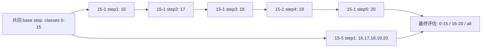
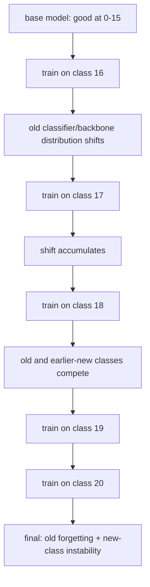
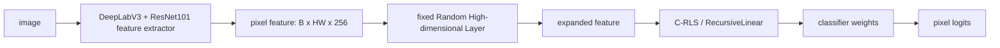
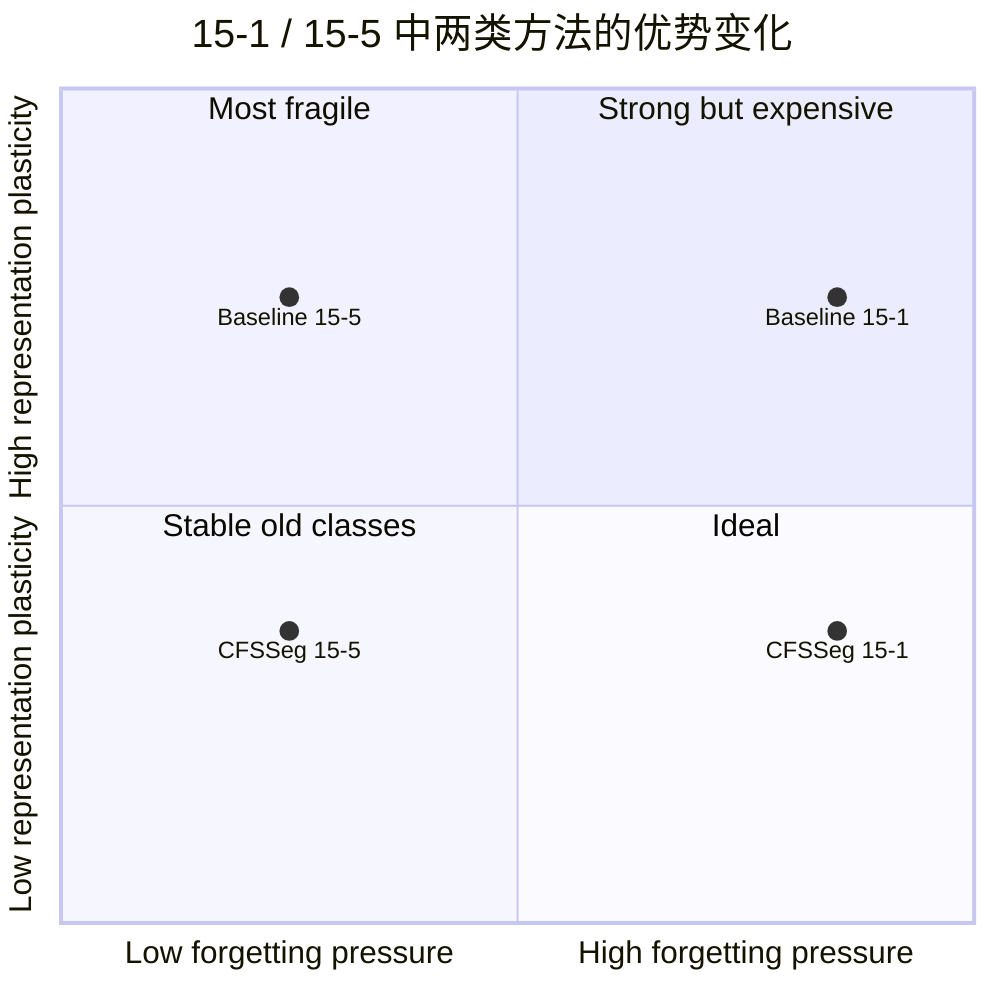
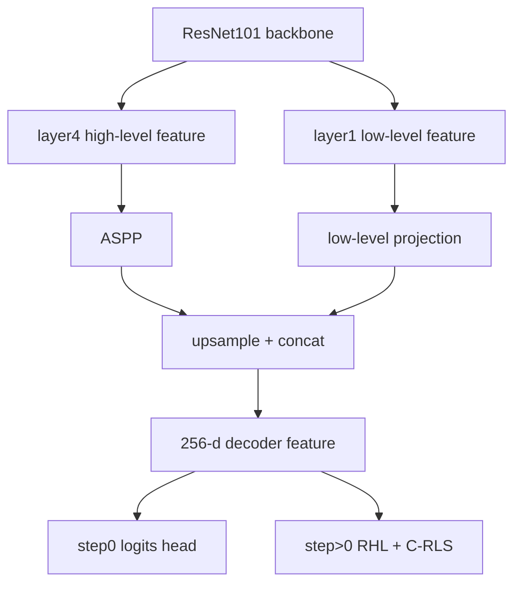

# CFSSeg Sequential 15-1 / 15-5 结果差异与 DeepLabV3+ 升级分析

日期：2026-06-10  
范围：Pascal VOC2012 2D class-incremental semantic segmentation，重点分析论文 Table III 的 sequential setting，并结合当前 SegACIL 代码与本地复现实验结果。

---

## 0. 结论先行

你的两个疑问可以浓缩成两句话：

1. **15-1 下 CFSSeg 大幅领先，核心不是因为它用了更强模型，反而论文里它用的是 DeepLabV3，而多数 sequential baseline 用的是 DeepLabV3+；领先主要来自闭式递归分类头在多 step 场景下避免累积遗忘。**
2. **15-5 下 CFSSeg 的 old mIoU 仍然强，但 new mIoU 没有优势，是因为 15-5 只有一次增量更新，梯度式 baseline 的遗忘压力小很多，同时它们可以端到端或半端到端地适配 5 个新类；CFSSeg 冻结 backbone，只能靠 RHL + 线性闭式头拟合新类，表示塑性不足会暴露出来。**

所以，论文里 15-1 和 15-5 的结果几乎一样，主要是 **方法机制** 导致的：在冻结特征、同一正则、同一累计样本集合下，C-RLS 递归更新近似保持“不同分组顺序得到相同最终解析解”的性质。  
而 baseline 在 15-1 和 15-5 下差别巨大，主要是 **训练协议敏感性** 导致的：15-1 要反复经历 5 次增量训练，15-5 只经历 1 次。

DeepLabV3+ 可以尝试升级，也很可能涨点，尤其是 new mIoU 和边界/小目标；但如果直接拿 `DeepLabV3+ 版 CFSSeg` 去和论文原始 `DeepLabV3 版 CFSSeg` 比，就不能说增益完全来自方法。更公平的写法是：**主表固定 DeepLabV3 + ResNet101；DeepLabV3+ 作为 strong decoder / architecture robustness 补充实验。**

---

## 1. 论文 Table III 的现象

论文原文 Table III：<https://arxiv.org/html/2412.10834v2>  
表名：CSS quantitative comparison on Pascal VOC2012 in mIoU (%) under sequential setting.

### 1.1 Sequential 15-1

| Method | Model | 0-15 | 16-20 | all |
|---|---|---:|---:|---:|
| FT | DeepLabV3+ | 49.0 | 17.8 | 41.6 |
| LwF | DeepLabV3+ | 33.7 | 13.7 | 29.0 |
| LwF-MC | DeepLabV3+ | 12.1 | 1.9 | 9.7 |
| ILT | DeepLabV3+ | 49.2 | 30.3 | 48.3 |
| CIL | DeepLabV3+ | 52.4 | 22.3 | 45.2 |
| MiB | DeepLabV3+ | 35.7 | 11.0 | 29.8 |
| SDR | DeepLabV3+ | 58.5 | 10.1 | 47.0 |
| SDR+MiB | DeepLabV3+ | 58.1 | 11.8 | 47.1 |
| CFSSeg | DeepLabV3 | **78.1** | **42.0** | **70.0** |

15-1 是 CFSSeg 最漂亮的场景：old 类保持非常强，new 类也明显领先。

### 1.2 Sequential 15-5

| Method | Model | 0-15 | 16-20 | all |
|---|---|---:|---:|---:|
| FT | DeepLabV3+ | 62.0 | 38.1 | 56.3 |
| LwF | DeepLabV3+ | 68.0 | 43.0 | 62.1 |
| LwF-MC | DeepLabV3+ | 70.6 | 19.5 | 58.4 |
| ILT | DeepLabV3+ | 71.3 | **47.8** | 65.7 |
| CIL | DeepLabV3+ | 63.8 | 39.8 | 58.1 |
| MiB | DeepLabV3+ | 73.0 | 44.4 | 66.1 |
| SDR | DeepLabV3+ | 73.6 | 46.7 | 67.2 |
| SDR+MiB | DeepLabV3+ | 74.6 | 43.8 | 67.3 |
| CFSSeg | DeepLabV3 | **78.1** | 42.0 | **70.0** |

15-5 下 CFSSeg 的整体 all 仍最好，主要靠 old mIoU 拉开；但 new mIoU 并不是最强，低于 ILT、MiB、SDR、SDR+MiB、LwF。

---

## 2. 先澄清：15-1 和 15-5 的 step0 是同一个 base 类集合

当前代码定义在 `utils/tasks.py`：

```python
"15-5": {
    0: [0, 1, ..., 15],
    1: [16, 17, 18, 19, 20]
},
"15-1": {
    0: [0, 1, ..., 15],
    1: [16],
    2: [17],
    3: [18],
    4: [19],
    5: [20]
}
```

因此：

| 协议 | base step | incremental steps | 最终新类集合 |
|---|---|---|---|
| 15-1 | 0-15 | step1:16, step2:17, step3:18, step4:19, step5:20 | 16-20 |
| 15-5 | 0-15 | step1:16-20 | 16-20 |

两者真正不同的不是 base 类，而是 **增量类到来的分组方式**。



这点非常关键：**论文表格里的 15-1/15-5 差异不是“step0 学得不一样”，而是最终经历不同增量路径后的结果。**

---

## 3. 为什么 baseline 在 15-1 和 15-5 下差别巨大

### 3.1 15-1 对梯度式 continual segmentation 极不友好

15-1 有 5 个增量 step。对 FT / LwF / MiB / SDR 这类方法来说，每个增量 step 都会重新进行梯度训练或蒸馏约束：



分割任务比图像分类更容易出现这个问题，因为每张图里有大量像素样本，背景、旧类、新类之间的竞争非常强。即使是 sequential setting，训练集旧类标签并不被压成背景，梯度训练仍然会不断改变共享 backbone、decoder 和 classifier，使旧类决策边界逐步漂移。

结果就是论文表里 baseline 的 15-1 old mIoU 普遍很低。例如 SDR 在 15-1 的 old mIoU 只有 58.5，但在 15-5 有 73.6。这个差距不可能只用 DeepLabV3+ 架构解释，因为它在两个协议里仍是 DeepLabV3+；真正变化的是 **增量 step 数量**。

### 3.2 15-5 只有一次增量训练，baseline 遗忘压力小很多

15-5 只做一次增量：从 0-15 直接学习 16-20。  
这有两个后果：

1. 梯度式 baseline 只被新任务冲击一次，old forgetting 没有 15-1 那么累积。
2. 五个新类同时出现，模型可以在同一个训练阶段联合调整新类之间的边界。

这解释了为什么许多 baseline 在 15-5 下 old mIoU 和 new mIoU 都明显上升。比如：

| Method | old 15-1 | old 15-5 | new 15-1 | new 15-5 | 机制解释 |
|---|---:|---:|---:|---:|---|
| FT | 49.0 | 62.0 | 17.8 | 38.1 | 少了 4 次后续覆盖 |
| LwF | 33.7 | 68.0 | 13.7 | 43.0 | 蒸馏约束不必跨 5 次传递 |
| MiB | 35.7 | 73.0 | 11.0 | 44.4 | background/old-new bias 修正压力小 |
| SDR | 58.5 | 73.6 | 10.1 | 46.7 | representation drift 次数减少 |

所以，baseline 的巨大差异主要来自 **15-1 是多次增量，15-5 是一次增量**，不是来自 step0 本身不同。

---

## 4. 为什么 CFSSeg 在 15-1 和 15-5 几乎一样

CFSSeg 的核心流程不是每个 step 继续反向传播训练整个分割网络，而是：

1. step0 用 DeepLabV3 + ResNet101 正常训练一个分割表征；
2. 增量阶段冻结表征；
3. 提取 dense pixel feature；
4. 通过 RHL 随机高维映射增强特征；
5. 用 C-RLS / RecursiveLinear 递归更新分类头。

当前代码中对应位置：

| 机制 | 代码位置 | 说明 |
|---|---|---|
| step0 反向传播训练 DeepLab | `trainer/trainer.py:214-262` | `outputs, _ = self.model(images)` 后 `loss.backward()` |
| step1 将 DeepLab classifier head 置空 | `trainer/trainer.py:268-286` | 加载 step0 checkpoint，`classifier.head = nn.Identity()`，构造 AIR |
| RHL 随机映射 | `network/Buffer.py:39-98` | `RandomBuffer` 固定随机投影 + activation |
| 解析递归更新 | `network/AnalyticLinear.py:107-165` | 累积 `R` 与 `weight`，使用闭式矩阵更新 |
| 测试 old/new/all | `trainer/trainer.py:352-369` | 按 base 类和 incremental 类分别算 mIoU |

简化成图：



### 4.1 递归闭式更新为什么对 class grouping 不敏感

在固定特征空间里，分类头求解本质上接近一个带正则的最小二乘问题：

```text
min_W ||XW - Y||^2 + gamma * ||W||^2
```

如果 15-1 和 15-5 最终看到的累计样本集合相同，且特征提取器不变，那么理论上：

```text
一次性用 classes 16-20 解出来的 W
≈
先用 class 16 更新，再 17，再 18，再 19，再 20 递归更新出来的 W
```

这就是论文里 15-1 和 15-5 都是：

```text
old 78.1 / new 42.0 / all 70.0
```

的核心原因。它不是“巧合”，而是在展示闭式递归更新的 grouping-invariant / order-robust 特征。

### 4.2 但这种不敏感有前提

CFSSeg 的“不怕多 step”不是无条件的，它依赖：

1. backbone 冻结后仍能提供足够好的新类特征；
2. RHL 映射后线性头能分开这些类别；
3. 标签质量足够可靠；
4. 每一步递归更新的数值稳定；
5. 评估协议、类别顺序、数据过滤一致。

因此它能很好地保护 old mIoU，但 new mIoU 的上限会受到冻结表征限制。15-5 下 baseline 的 new mIoU 反超，正好说明这个限制是真实存在的。

---

## 5. 为什么 15-5 下 CFSSeg new mIoU 不占优

15-5 的新类是一次性加入 5 个类别：16,17,18,19,20。  
这时 baseline 和 CFSSeg 的优缺点发生了交换：

| 方法类型 | 15-1 多 step | 15-5 单 step |
|---|---|---|
| 梯度式 baseline | 容易累积遗忘，old/new 都被拖累 | 遗忘压力小，可以适配新类表示 |
| CFSSeg | 不反复破坏旧知识，多 step 优势明显 | old 仍强，但新类只能靠冻结特征 + 线性头 |

更直观地说：



解释：

- CFSSeg 的 representation plasticity 低，因为增量阶段冻结 backbone；
- baseline 的 representation plasticity 高，因为还能用梯度调整网络；
- 15-1 的 forgetting pressure 高；
- 15-5 的 forgetting pressure 低。

所以在 15-1，CFSSeg 的“低遗忘”优势压过了“低塑性”劣势；  
在 15-5，baseline 的遗忘压力降低后，“可塑性”优势就显出来了，new mIoU 可以超过 CFSSeg。

---

## 6. 本地复现实验是否支持这个解释

支持。

当前本地已有结果：

| 本地实验 | 协议 | step | old 0-15 | new 16-20 | all |
|---|---|---:|---:|---:|---:|
| `1128_trs` | 15-1 | step5 | 77.91 | 40.28 | 68.95 |
| `20260606` | 15-5 | step1 | 78.01 | 42.11 | 69.46 |
| `20260607` | 15-5 | step1 | 77.79 | 43.21 | 69.56 |
| `20260610_rhl_none_g1` | 15-5 | step1 | 78.01 | 42.11 | 69.46 |

这和论文的趋势一致：

| 来源 | 15-1 old | 15-1 new | 15-1 all | 15-5 old | 15-5 new | 15-5 all |
|---|---:|---:|---:|---:|---:|---:|
| 论文 CFSSeg | 78.10 | 42.00 | 70.00 | 78.10 | 42.00 | 70.00 |
| 本地复现 | 77.91 | 40.28 | 68.95 | 78.01 / 77.79 | 42.11 / 43.21 | 69.46 / 69.56 |

本地 15-1 new mIoU 略低于论文，前面已经排查过可能与恢复训练、随机性、实现细节和运行状态有关；但大方向不变：CFSSeg 的 old mIoU 很稳，15-1 与 15-5 最终 all mIoU 很接近。

### 6.1 关于本地 `step0/test_results_*.json` 的一个陷阱

当前仓库里 `15-5/step0/test_results_*.json` 不能简单理解为“纯 step0 DeepLab 刚训练完的结果”。原因在 `trainer/trainer.py:263-294`：

1. 当 `curr_step == 1` 时，代码临时把 `opts.curr_step = 0`；
2. 用 step0 checkpoint 构造 AIR；
3. 对 step0 数据做 realignment；
4. 保存到 `step0/final.pth`；
5. 调 `do_evaluate_after_realign()`，结果写回 `step0/test_results_*.json`。

因此本地看到的某些 15-5 step0 JSON 是 **step1 过程中重对齐后的 step0 AIR 结果**，而不是原始 DeepLab step0 CNN 结果。  
尤其 15-5 的 step0 JSON 会把未来 5 个新类都计入全类平均且这些类 IoU 为 0，Mean IoU 看起来会明显低。不能拿它直接和 15-1 的 step0 JSON 当作“两个 base model 的纯能力差异”比较。

---

## 7. 到底是模型差别，还是方法机制差别？

答案要分层：

### 7.1 论文表格有架构差异，严格公平性不是完美的

Table III 里 sequential baseline 多数标注为 DeepLabV3+，CFSSeg 标注为 DeepLabV3。  
这意味着：

- 如果只看绝对数值，确实存在 decoder/backbone protocol 不完全一致的问题；
- CFSSeg 在 15-1 用更弱或至少不更强的 decoder 仍然大幅领先，说明优势不是靠 DeepLabV3+ 堆出来的；
- 但 15-5 new mIoU 低于几个 DeepLabV3+ baseline，也可能包含 DeepLabV3+ decoder 对新类边界、低层细节和联合适配更强的影响。

### 7.2 但 15-1 / 15-5 差异模式主要由方法机制决定

判断依据：

1. baseline 在 15-1 和 15-5 下使用的是同类模型，但结果差别巨大；
2. CFSSeg 在 15-1 和 15-5 下结果几乎相同；
3. 当前代码中 15-1 与 15-5 的 base 类集合完全相同；
4. CFSSeg 的增量阶段没有继续更新 backbone，而是递归更新解析头；
5. 多 step 越多，梯度式方法越容易遗忘；闭式递归方法越能体现优势。

所以更准确的归因是：

```text
DeepLabV3 vs DeepLabV3+:
    影响绝对上限，尤其影响 new-class mIoU 和边界质量。

CFSSeg vs gradient-based baselines:
    决定 15-1 多 step 下是否累积遗忘，决定 15-1/15-5 结果是否稳定。
```

换句话说，**模型差别是混杂因素，方法机制是主因。**

---

## 8. 如果把 CFSSeg 的 DeepLabV3 升级为 DeepLabV3+，能否涨点？

### 8.1 理论上可以涨，最可能涨在 new mIoU

DeepLabV3+ 相比 DeepLabV3 的主要优势是 decoder 使用低层特征，空间细节和边界恢复更好。  
对于 VOC 这种目标边界明显、物体尺度变化大的数据集，它可能带来：

| 指标 | 预期影响 | 原因 |
|---|---|---|
| old 0-15 mIoU | 可能小幅上升或持平 | base step 表征更强，但 old 已经接近 78 |
| new 16-20 mIoU | 更可能上升 | 新类依赖冻结表征，V3+ 的低层细节可能改善线性可分性 |
| all mIoU | 取决于 new 类提升是否超过训练噪声 | VOC all 是 21 类平均，new 类只有 5 类 |
| 15-1 vs 15-5 一致性 | 理论上仍应接近 | 只要增量阶段仍冻结特征并使用同一 C-RLS 目标 |

但这里有一个重要限制：DeepLabV3+ 提升的是 **特征/decoder 底座**，不是闭式递归算法本身。论文写作时不能把它当成 CFSSeg 方法机制的直接改进。

### 8.2 什么情况下仍然公平

公平对比可以这样设计：

| 实验角色 | 网络底座 | 用途 | 是否适合主结论 |
|---|---|---|---|
| 主 baseline | DeepLabV3 + ResNet101 | 复现论文 CFSSeg | 是 |
| 你的方法主实验 | DeepLabV3 + ResNet101 | 验证 RHL normalization / pseudo-label 等改进 | 是 |
| 强 decoder 补充 | DeepLabV3+ + ResNet101 | 验证方法在更强 decoder 下是否仍有效 | 可以作为补充 |
| 只报 DeepLabV3+ 改进 | DeepLabV3+ + ResNet101 | 容易被认为是架构增益 | 不适合当核心贡献 |

推荐写法：

```text
For fair comparison with CFSSeg, all main experiments use the same DeepLabV3-ResNet101 backbone.
We further report a DeepLabV3+ variant to evaluate architecture robustness under a stronger decoder.
```

### 8.3 当前代码不能只改 `MODEL=deeplabv3plus_resnet101`

当前仓库里虽然 `network/modeling.py` 的 `model_map` 有：

```python
'deeplabv3plus_resnet101': self.deeplabv3plus_resnet101
```

但 ResNet 分支 `_segm_resnet()` 只支持：

```python
if name == 'deeplabv3':
    classifier = DeepLabHead(...)
elif name == 'deeplabv3_bga':
    classifier = DeepLabHeadBgA(...)
else:
    raise ValueError(...)
```

所以 `deeplabv3plus_resnet101` 会报 `Unsupported model name 'deeplabv3plus' for ResNet backbone.`

此外还有两个接口问题：

1. `DeepLabHead.forward()` 返回 `(heads, feat_dict)`，但 `DeepLabHeadV3Plus.forward()` 当前只返回 `heads`，不符合 step0 训练代码的解包接口。
2. `trainer/trainer.py:275-286` 构造 AIR 时写死 `backbone_output=256`，并通过 `classifier.head = nn.Identity()` 暴露 256 维 dense feature；V3+ head 当前不是这个结构，需要重新定义“给 AIR 的 256 维 feature 到底取哪里”。

### 8.4 如果要做，最小工程路线

建议不是直接替换，而是做一个明确的 `deeplabv3plus_resnet101_air` 分支：



最低需要改：

1. `network/modeling.py`
   - ResNet V3+ 分支 `return_layers = {'layer4': 'out', 'layer1': 'low_level'}`；
   - 使用 `DeepLabHeadV3Plus(inplanes=2048, low_level_planes=256, ...)`。
2. `network/_deeplab.py`
   - 让 `DeepLabHeadV3Plus.forward()` 返回 `(heads, feat_dict)`；
   - 在 `feat_dict` 中提供稳定的 256-d decoder feature；
   - 把最后 logits 层和 feature extractor 分离，方便 step1 替换成 AIR。
3. `trainer/trainer.py`
   - 不要硬编码 `classifier.head = nn.Identity()` 这一种 head 结构；
   - 抽象出 `model.extract_dense_feature_for_air()` 或统一 classifier 的 `feature_mode`；
   - `backbone_output` 根据实际 feature channel 自动取值。
4. 实验上必须重训 step0
   - 旧的 DeepLabV3 checkpoint 不能复用；
   - 所有 15-1 / 15-5 对比要重新跑。

---

## 9. 推荐实验矩阵

如果目标是写论文或形成有说服力的报告，建议这样排：

| 组别 | Model | Method | 15-1 | 15-5 | 目的 |
|---|---|---|---|---|---|
| A | DeepLabV3-R101 | CFSSeg 原始 | 必跑 | 必跑 | 复现论文主线 |
| B | DeepLabV3-R101 | 你的改进 | 必跑 | 必跑 | 公平证明方法有效 |
| C | DeepLabV3+-R101 | CFSSeg 原始 | 可选 | 可选 | 强 decoder baseline |
| D | DeepLabV3+-R101 | 你的改进 | 可选 | 可选 | architecture robustness |

写作时主比较看：

```text
B - A = 方法改进带来的增益
D - C = 同一强 decoder 下方法是否仍有效
C - A = decoder 架构本身带来的增益，只能作为分析，不应作为核心贡献
```

---

## 10. 最终回答

### 问题 1：为什么 15-1 大幅领先，15-5 只在 old mIoU 上优势明显？

因为 15-1 是多 step 增量，baseline 需要多次梯度更新，old 类和 earlier-new 类都会经历多轮漂移，遗忘严重；CFSSeg 的 closed-form recursive head 不反复改 backbone 和旧头，能显著减少累积遗忘，所以 old 和 new 都强。  
15-5 只有一次增量，baseline 的遗忘压力小很多，同时 DeepLabV3+ baseline 可以更充分地适配 5 个新类；CFSSeg 的 backbone 冻结，new 类只能靠固定表征 + RHL + 线性闭式头，因此 new mIoU 不一定占优。

### 问题 1 的补充：为什么同样 step0，baseline 15-1/15-5 差别大，而 CFSSeg 几乎一样？

论文表不是在比较纯 step0，而是在比较最终 step。15-1 和 15-5 的 step0 类集合相同，但后续路径不同：15-1 有 5 次增量训练，15-5 只有 1 次。baseline 对路径非常敏感；CFSSeg 在固定特征和同一累计数据下，递归解析更新接近同一个最终闭式解，所以 15-1/15-5 几乎一样。

### 问题 1 的归因：是 DeepLabV3+ vs DeepLabV3，还是方法机制？

主要是方法机制。DeepLabV3+ 会影响绝对性能，尤其影响 new mIoU，但它不能解释 baseline 在 15-1 和 15-5 下的巨大差异，因为 baseline 自己在两个协议里仍是同类架构。CFSSeg 结果稳定的核心原因是冻结特征 + RHL + C-RLS 的闭式递归机制。

### 问题 2：升级 DeepLabV3+ 能否在公平前提下涨点？

可以尝试，也有较大概率涨 new mIoU；但公平前提是所有被比较的方法共享同一网络底座，或者把它明确写成 strong decoder 补充实验。当前主线最公平的是继续用 DeepLabV3 + ResNet101 做核心方法对比；DeepLabV3+ 应作为补充实验，回答“更强 decoder 下方法是否仍然有效”，而不是直接把涨点归因给 CFSSeg 方法本身。

---

## 11. 参考证据

- CFSSeg arXiv HTML：<https://arxiv.org/html/2412.10834v2>
- CFSSeg PDF：<https://arxiv.org/pdf/2412.10834>
- 当前代码任务划分：`utils/tasks.py`
- 当前代码训练与评估：`trainer/trainer.py`
- 当前 DeepLab 实现：`network/modeling.py`, `network/_deeplab.py`
- 当前 RHL 与解析头：`network/Buffer.py`, `network/AnalyticLinear.py`
- 本地结果来源：`checkpoints/1128_trs/...`, `checkpoints/20260606/...`, `checkpoints/20260607/...`, `checkpoints/20260610_rhl_none_g1/...`
